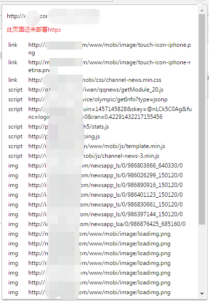

# checkhttp
检测当前页面中还有http的资源，为转换到https做准备

做了一个简单的chrome扩展程序（插件），方便检测当前页面中含有http的资源，进行排除。  

  

在chrome浏览器里输入`chrome://extensions/`，进入到扩展程序页面：  

1. 打开开发者模式；  
2. 点击“加载已解压的扩展程序”，选择源码的文件夹，确定即可  

在浏览器的右上角就能看到一个锁子图标了。  